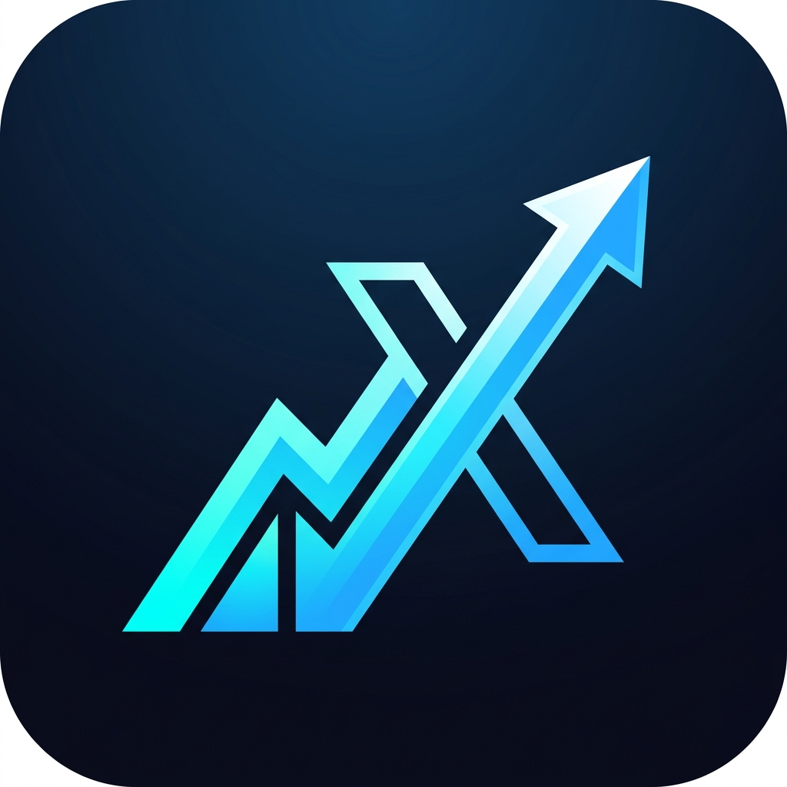

  
  
  # 🎯 PercentileX
  
  **The Ultimate AI-Powered CAT Preparation Platform**
  
  
  
  

 

**PercentileX** is a cutting-edge mobile application built to help aspirants conquer the Common Admission Test (CAT). By leveraging **Google Gemini AI** and real-time backend synchronization via **Firebase**, PercentileX provides an incredibly personalized, gamified, and analytical approach to studying.

---

## 📥 Download the App

Download the App from releases.

---

## 📱 Screenshots

  <!-- Replace these links with your actual screenshot URLs -->
  <!-- You can just drag and drop images directly into the GitHub Web Editor to generate links! -->
  
  
  
  

---

## ✨ Features

### 🧠 Mentor AI & Smart Planning
Powered by Google Gemini 2.5, your personal Mentor AI analyzes your past performance, accuracy, and time spent to curate **customized daily study plans** and identify your weakest areas.

### 📊 Advanced Analytics Engine
A comprehensive tracking dashboard featuring:
- **Study Heatmaps:** Track your daily consistency.
- **Percentile Trends:** Visualize your mock exam progression over time.
- **Topic Performance Radar:** Instantly see where you excel and where you need work.
- **Dynamic Time Filtering:** Filter all data by Week, Month, or 3 Months.

### 📚 Premium Practice & Mocks
- Dive into **VARC, DILR, and Quants** with thousands of questions.
- Features difficulty-based filtering and beautiful layered UI cards.
- Take full-length, highly accurate mock exams designed to simulate the real test environment.

### 🏆 Gamification & Leaderboards
- **XP & Levels:** Earn XP points for every question answered and level up from *Beginner* to *IIM Legend*.
- **Achievements:** Unlock badges for streaks, high accuracy, and dedication.
- **Leaderboards:** Compete on Global, Weekly, and Friends leaderboards.

### 🕶️ Flawless Dark Mode
A stunning, contrast-optimized dark theme featuring rich glassmorphism effects, dynamic shadows, and glowing premium gradients. Legibility is automatically optimized based on your system theme.

---

## 🛠️ Technology Stack

- **Frontend:** Flutter & Dart (GetX for State Management & Routing)
- **Backend:** Firebase (Firestore, Authentication, Cloud Messaging)
- **AI Integration:** Google Gemini Pro API
- **Data Visualization:** FL Chart
- **Local Storage:** Hive & Shared Preferences

---

*“Your target percentile isn't going to achieve itself. Let's get to work.”* 🚀
